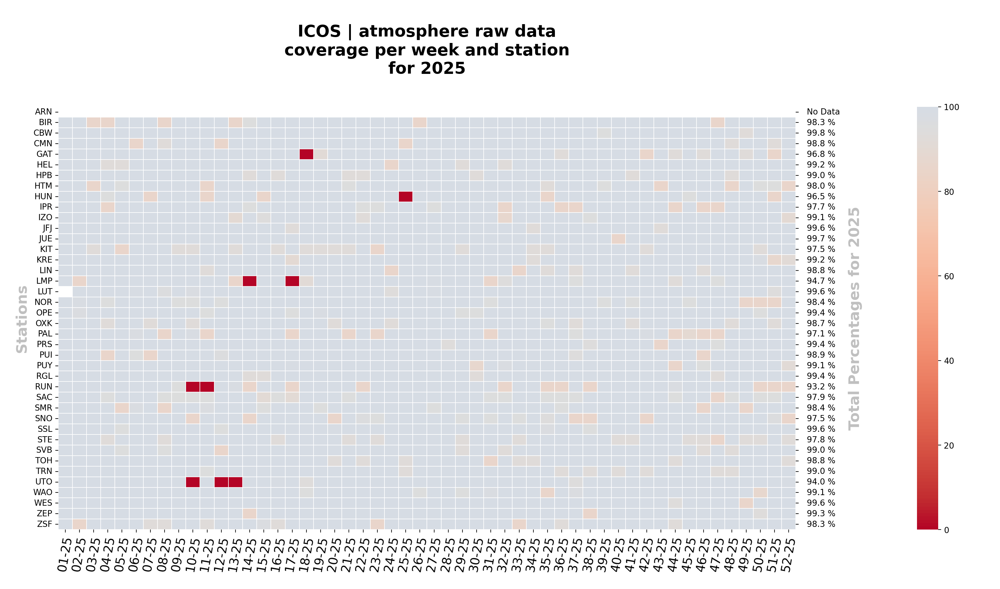
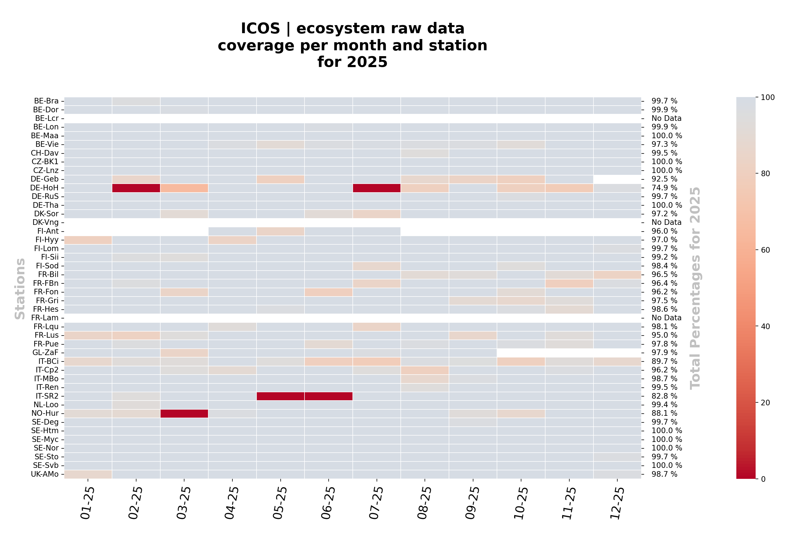

# ICOS Heatmaps

ICOS Heatmaps is a Python CLI that visualises raw data coverage across ICOS
network stations. It fetches data live from the ICOS Carbon Portal via SPARQL
and renders colour-coded heatmaps — broken down by station and time bin — for
the atmosphere and ecosystem domains.

## Installation

Python 3.11 or later is required.

Run the following commands to set up the environment and install the package:

```bash
git clone <repo-url>
cd heatmaps
python -m venv .venv
source .venv/bin/activate
pip install .
```

Use `pip install -e .` instead if you intend to modify the source code
(development / editable install).

## Usage

### Single heatmap

Generate a heatmap for a single calendar year and domain:

```bash
heatmaps --year 2024 --domain atmosphere
heatmaps --year 2024 --domain ecosystem --bin weekly
```

Options:

- `--domain`: `atmosphere` or `ecosystem` (required)
- `--year`: calendar year (required)
- `--bin`: `monthly` or `weekly`, defaults to `monthly`

### Period heatmap

Generate a heatmap spanning a custom time range:

```bash
heatmaps --period 2019-2024 --domain atmosphere
heatmaps --period 012024-092024 --domain ecosystem
heatmaps --period 01012020-31012020 --domain atmosphere --bin weekly
```

Options:

- `--period`: time range in one of three formats:
  - `YYYY-YYYY` — year range
  - `MMYYYY-MMYYYY` — month-year range
  - `DDMMYYYY-DDMMYYYY` — day-month-year range
- `--bin`: optional; auto-detected from period length if omitted —
  weekly for periods shorter than 60 days, monthly otherwise
- `--domain`: `atmosphere` or `ecosystem` (required)

### Report mode

Generate a full pre-defined yearly bundle in one step:

```bash
heatmaps --report 2025
```

This writes output under `output/<timestamp>/report-2025/` and includes:

- `standalone-years/<year>/` — monthly and weekly heatmaps for atmosphere
  and ecosystem, one subdirectory per year from 2020 to the given year
- `cumulative/` — monthly heatmaps for atmosphere and ecosystem from
  2020 to the given year
- `tables/` — yearly percentages Excel workbooks for atmosphere and
  ecosystem from 2020 to the given year

## Examples

Atmosphere domain, weekly bin, 2025:

```bash
heatmaps --year 2025 --domain atmosphere --bin weekly
```



Ecosystem domain, monthly bin, 2025:

```bash
heatmaps --year 2025 --domain ecosystem --bin monthly
```



## Shared options

- `--cache-dir <path>`: cache fetched SPARQL data as parquet files on disk.
  On subsequent runs over the same time range, data is read from cache
  instead of being re-fetched, which can save significant time.
- `--output-dir <path>`: base directory for output. Defaults to `output/`
  under the current working directory. A timestamped subdirectory is always
  created inside it.

## Output

Each invocation creates a timestamped subdirectory under the output base
directory, using the format `YYYYMMDDTHHmmSS`. 

## Credits

`heatmaps` was developed within the ICOS / Carbon Portal ecosystem.

Contributors:

- Alex Vermeulen
- [Claude Code](https://claude.ai/code) by Anthropic
- Zois Zogopoulos
